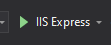
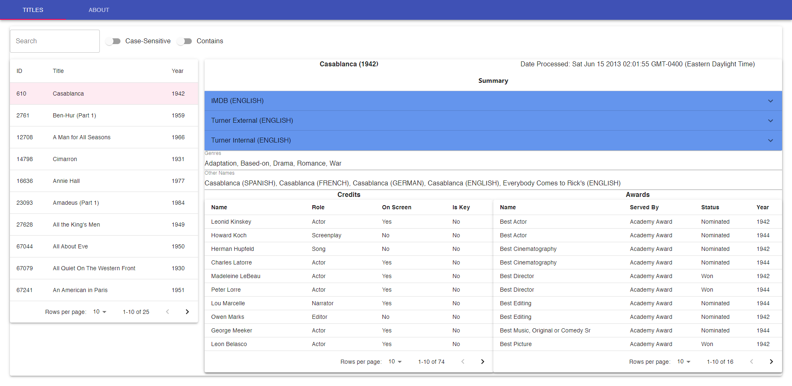

# MarketPlace
This project contains a rudimentary .NET Core-based Web API, a React-based web-application, and a folder that contains some documentation regarding the project requirements.
The purpose of this solution is to demonstrate a web-client's communication with a RESTful Web API. The Web API facilitates communication between the client and a MS SQLExpress database.
The provided Web API only provides route that allow the client to GET. There is no means, currently, to POST or DELETE data.

## Installation and Usage
You will need the following:

- [ ]  An instance of SQLExpress Server hosting a database called "Titles"
- [ ] Visual Studio (I used 2019) or some other means of running the Web API (which is based on .NET Core)
- [ ] Node.js and NPM, to run the Web-Client

Use the seed-data query in Marketplace.Documentation to initialize the database with data, by running the query on master, BEFORE you create the Titles database.

You will want to open the Web API project and replace any instance of 

>     Server=DESKTOP-HUE2\\SQLEXPRESS; Database=Titles; Trusted_Connection=True; MultipleActiveResultSets=true

 with a connection string that is more appropriate for your machine, however you have your instance configured.
 **You will find this in the appsettings.json and the appsettings.Development.json file in the root of the API Project.**

To run the Web API, assuming that you are using Visual Studio 2019, please open the solution file "Marketplace.sln" and be sure that Marketplace.API is set as the start-up project. And then run the application using IIS Express (Debug with Any CPU selected should be fine).
**Please note that the Web API runs out of port 44356 on localhost.** 

To run the Web Client, please open command-line and navigate to the folder "Marketplace.Web". From there, run the command 
> npm install

to grab all of the dependencies that the Web Client requires. 

Afterwards, you may run the command
> npm start

to start a development instance of the application, **which runs on port 8081 on the localhost**.
After the Web Client starts, you may navigate (if it didn't automatically) to http://localhost:8081 to view the home page.

The two ports mentioned are important, because the Web API has a CORS policy that allows requests from the Web Client's origin. If you must change this for any reason, please change this where necessary
in the Web API's Startup.cs file, under the Configuration of Services.

## Acknowledgements
### Material UI's Accordian
One minor note is that I am aware of an issue with Material UI's Accordian. When expanding an Accordian, you may be greeted with a console message that looks like this: 
> Warning: findDOMNode is deprecated in StrictMode. findDOMNode was passed an instance of Transition which is inside StrictMode. Instead, add a ref directly to the element you want to reference. Learn more about using refs safely here: https://reactjs.org/link/strict-mode-find-node 

This seems to be a problem with Material UI's implementation and they have not yet caught up to React-dev.

### Future Improvements
I really want to do the following:
 1. Add Authentication so that only the Web Client can access the API
 2. Really separate out the Business logic and the API logic, even further
 3. Design a better layout for the Web Client - I actually underestimated the amount of metadata tied to a Title. It was my desire to keep things simple and shove everything onto one page, but things are getting a little cramped.
 4. Add a layer for Adding and Deleting Titles, as well as modifying data.
 5. Add unit testing
